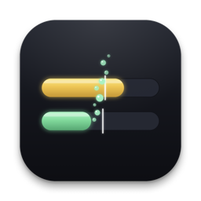

<p align="center">
  
</p>

# Quotty (macOS)

<p align="center">
  <b><a href="README.md">🇷🇺 Русский</a></b> | <b><a href="README_EN.md">🇬🇧 English</a></b>
</p>

> 💡 **Нативный порт [Quotty](https://github.com/confeden/Quotty) на Swift (SwiftUI + AppKit) для macOS.**  
> Автор оригинального проекта для Windows: **[@confeden](https://github.com/confeden)** ([Telegram](https://t.me/nova_txt)).

Интерактивный и удобный счётчик квот для **Claude / Codex / Antigravity** на macOS — показывает не только текущий расход лимита, но и то, насколько быстро вы его расходуете.


Тонкая полоска поверх всех окон: показывает, сколько квоты осталось у ИИ-инструмента, в котором вы сейчас работаете, и когда лимит обнулится.

Полоска сама переключается на тот инструмент, окно которого было активно последним.
Поддерживаются три семейства:

- **Antigravity** — Antigravity 2.0, Antigravity IDE и CLI (`agy`);
- **Codex** — приложение Codex/ChatGPT и Codex CLI;
- **Claude** — приложение Claude Desktop и Claude Code / CLI.

---

## Возможности

### Новое в 1.4.4

- **Красное Out of Quota при исчерпанном недельном лимите Antigravity**: нулевая недельная квота блокирует группу моделей даже при запасе в 5-часовом окне. Отображается недельное время сброса (без выдуманных дат), скрывается процентная надпись, а режим отображения исчерпанных квот полностью соблюдается.
- **Выбор языка интерфейса: Русский / English**: переключатель в настройках, русский по умолчанию. Применяется без перезапуска к полоске, окну настроек, контекстному меню, строке меню macOS и меню в Dock.
- **Улучшения компоновки**: длинный заголовок полоски больше не наезжает на индикаторы скрытых квот в шапке.
- **Универсальное чтение CSRF**: чтение журнала Antigravity поддерживает оба формата (`--csrf_token <uuid>` и `--csrf_token=<uuid>`).

### Основные функции

- **Отдельная строка на каждое окно лимита** (от 5 часов до недели/месяца — что отдаёт сервис).
- **Полоса расхода с белой отметкой времени**: видно, тратите вы быстрее или медленнее, чем истекает лимит:
  - 🟢 **зелёная** — идёте с запасом, из края расхода поднимаются пузырьки;
  - 🟡 **жёлтая** — тратите быстрее, чем идёт время (перерасход);
  - 🟠 **оранжевая** — лимит выбран полностью (100%).
- **Точное время сброса** и сколько до него осталось в часах и минутах.
- **Автопереключение по активному окну** — включая CLI, запущенный в терминале (Terminal, iTerm2, Alacritty, Warp, Ghostty, Kitty, VS Code, Cursor).
- **Режим работы в Dock / Меню**: по умолчанию работает как легковесная утилита строки меню (не занимает место в Dock), с возможностью включить иконку в Dock, живой бейдж оставшейся квоты и Dock-меню в Настройках.
- **Управление**: перетаскивание — ЛКМ по любому месту, контекстное меню и настройки — ПКМ по полоске, клик по иконке в строке меню или по значку в Dock.

---

## Приватность

- **Нет телеметрии.** Ни аналитики, ни счётчиков, ни сбора статистики.
- **Нет рекламы.** Никаких баннеров, партнёрских ссылок и трекеров.
- **Нет сторонних серверов.** Программа обращается только напрямую к API самих сервисов (Anthropic, OpenAI) и к локальному языковому серверу Antigravity на `127.0.0.1`.
- Токены читаются локально, из хранилищ уже установленных программ, и уходят только тому сервису, которому принадлежат. Quotty ничего не пишет в чужие файлы и не обновляет чужие токены.
- Свои настройки Quotty хранит локально в `~/Library/Application Support/Quotty/settings.json`.

---

## Откуда берутся данные

| Инструмент | Источник |
|---|---|
| **Antigravity** | локальный языковой сервер Antigravity — тот же запрос, что делает панель расхода в самой IDE |
| **Codex** | `~/.codex/auth.json` (общий у приложения и CLI) → эндпоинт использования Codex |
| **Claude** | локальный токен Claude Desktop / CLI → официальный эндпоинт использования аккаунта |

Если инструмент не установлен или не запущен, его источник помечается как недоступный, а остальные продолжают работать.

---

## Установка

### Готовое приложение
1. Скачайте архив **`Quotty-macOS.zip`** со страницы [Releases](https://github.com/Zircon04/Quotty-macOS/releases).
2. Распакуйте и перетащите `Quotty.app` в папку **«Программы»** (`/Applications`).
3. Запустите.

> [!TIP]
> **Если macOS пишет: «“Quotty” повреждена, её следует переместить в Корзину»**  
> *(«“Quotty” is damaged and can’t be opened. You should move it to the Trash»)*:  
> Это стандартная блокировка macOS Gatekeeper для открытых программ, скачанных из браузера без платного сертификата Apple Developer.  
> Чтобы снять карантин, откройте **Терминал** и выполните команду:
> ```bash
> xattr -cr /Applications/Quotty.app
> ```
> *(если приложение находится в Загрузках: `xattr -cr ~/Downloads/Quotty.app`)*, после чего запустите снова.

---

## Как пользоваться

- **ЛКМ по полоске** — перетащить в любое удобное место экрана (позиция автоматически сохраняется).
- **ПКМ по полоске** — открыть меню настроек, сменить инструмент или настроить прозрачность.
- **Иконка в строке меню** — отображает текущий статус и даёт быстрый доступ ко всем функциям.

---

## Требования

- macOS 13.0 (Ventura) или новее (Apple Silicon M1/M2/M3/M4 или Intel).
- Установленный инструмент, чью квоту нужно смотреть: Antigravity, Codex CLI / приложение, Claude Desktop.
- Для Antigravity — запущенное приложение или IDE (квота живёт в его локальном языковом сервере).

---

## Сборка из исходников

Для сборки требуется компилятор Swift (входит в бесплатный Xcode или Command Line Tools: `xcode-select --install`):

```bash
git clone https://github.com/Zircon04/Quotty-macOS.git
cd Quotty-macOS
./scripts/build_app.sh
```

Готовый бандл `Quotty.app` появится прямо в корне репозитория.

---

## Портировано с ❤️

- 💡 Оригинальная идея, дизайн и версия для Windows: **[@confeden](https://github.com/confeden)**
- 🙋 Группа автора оригинала в Телеграм: **[@nova_txt](https://t.me/nova_txt)**
- ☕ [Отблагодарить автора оригинала](https://nova-app.eu/donate)
- 🍏 Нативный порт для macOS: **SwiftUI + AppKit**
